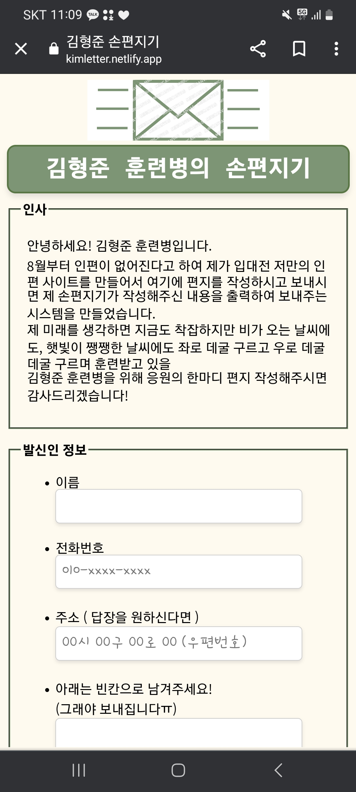
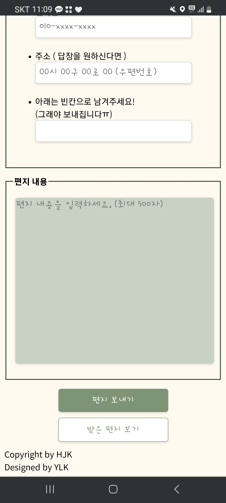
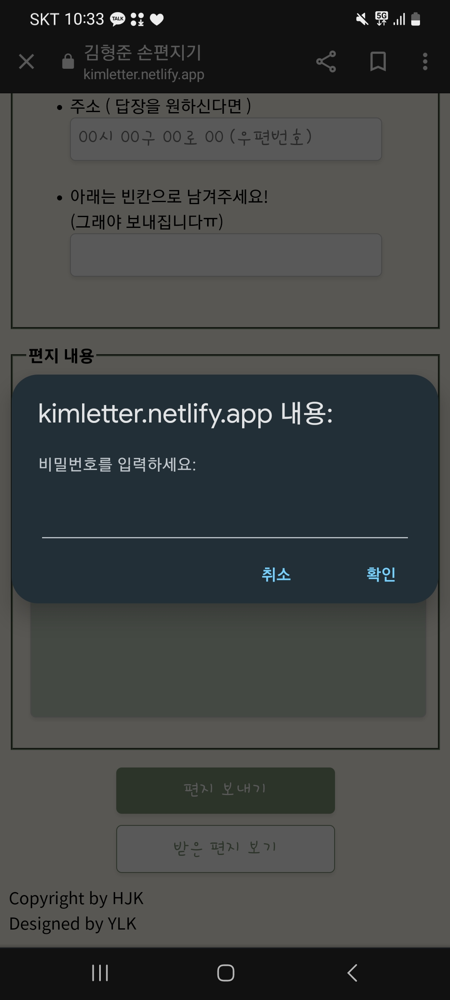
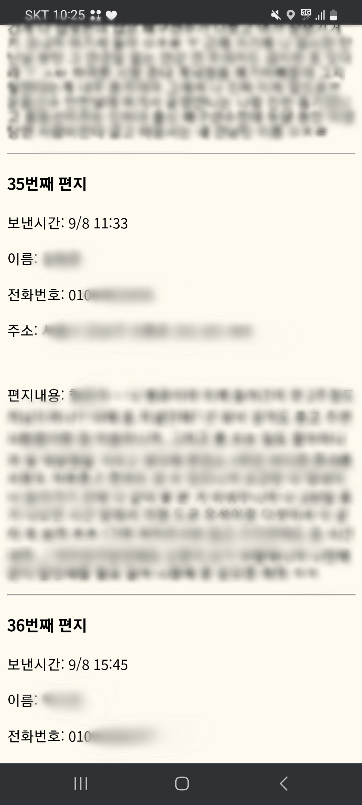

# 📬 손편지기 (Hand Letter Web Service)

> 군 입대 훈련소 기간에 사용한
> **인터넷 편지 웹 서비스**

---

## 1. 프로젝트 개요

**손편지기**는  
입대 15일 전 군대 인터넷 편지가 폐지되는 문제에 직접 솔루션을 찾아 해결해보고자 하여 **나만의 인터넷 편지 사이트**를 기획하고 제작하게 됨.

- 실제 사회적·개인적 문제 해결
- 클라이언트–서버 통신 구조에 대한 이해
- 서버리스(Serverless) 아키텍처 실습

---

## 2. 결과 화면

  
  
  
  

---

## 3. 제작 목적

- 입대 전 인터넷 편지 중단 문제를 해결하기 위한 **대체 웹 서비스 구현**
- AJAX, JSON API 기반 **클라이언트–서버 통신 실전 경험**
- Google Firebase를 활용한 **서버리스 백엔드 구조 학습**

---

## 4. 개발 기간

- **2023.08 ~ 2023.08 (약 2주)**

---

## 5. 기술 스택

### Frontend
- HTML
- CSS
- JavaScript

### Backend / Database
- Firebase (Realtime Database)

### Deployment
- Netlify

### Design
- Figma

---

## 6. 배운 점

1. 단순해 보이는 웹 서비스도 실제 배포 수준으로 완성하기 위해서는 수백~수천 회의 코드 수정이 필요함을 경험
2. 개발자는 기술뿐 아니라 **문제를 끝까지 해결하려는 태도와 끈기**가 중요함을 체감
3. AJAX 및 JSON API를 활용한 클라이언트–서버 통신 흐름을 실습을 통해 명확히 이해
4. UI 구현 과정에서 **사용자 관점의 디자인과 모바일 환경 대응의 중요성**을 인식

---

## 7. 문제점 및 해결 방법

### 7.1 Firebase 버전 선택

**문제점**
- Firebase v8: 빠른 개발 속도, 높은 생산성
- Firebase v10: 높은 안정성, 보안 및 기능 확장성

**해결 방법**  
개발 기간이 짧고 기능이 단순한 프로젝트 특성을 고려하여,  
**개발 효율을 최우선으로 Firebase v8을 선택**

---

### 7.2 모바일 기기별 UI 불일치 문제

**문제점**  
PC 환경에서는 정상 동작하였으나, 모바일 기기별로 UI가 상이하게 표시됨

**해결 방법**
- 입력창 및 div 요소의 고정 길이가 원인임을 파악
- Fieldset, Input, Padding, Layout 전반을 반응형 구조로 수정
- 해상도와 기기에 관계없이 동일한 UI 유지

---

### 7.3 촉박한 일정 속 UI 전면 수정

**문제점**  
배포 3일 전 사용자 테스트 과정에서 다수의 UI 피드백 발생

**해결 방법**
- 즉시 디자이너에게 신규 UI 의뢰
- 도안 수령 당일부터 작업을 시작하여 2일 만에 전면 수정 완료

**핵심 교훈**
> 시도하기 전부터 불가능하다고 판단하지 말 것

---

## 8. 협업 방식

- 디자이너와 협업하여 Figma 기반 디자인 도안 전달받음
- CSS를 직접 작성하여 디자인 시안과 **약 99% 유사한 UI 구현**

---

## 9. 담당 역할

- 웹 서비스 기획
- 프론트엔드 UI 구현
- 클라이언트–서버 통신 API 개발
- Firebase 데이터베이스 설계 및 구축

---

## 10. 개발 일지 (발췌)

### 2023.08.13
- Chrome, Edge, Mobile 환경에서 Firebase DB 데이터 전송 성공
- 약 150회 이상의 코드 수정 후 구현 완료

### 2023.08.18
- Firebase DB 데이터를 화면에 출력하는 `getData()` 함수 구현

### 2023.08.21
- 최종 버전 완성
- 모바일 사용자를 고려한 사용자 중심 디자인의 중요성 인식

### 2023.12
- 웹 서비스를 하이브리드 앱으로 확장하기 위해 React Native 학습 시작

---

## 11. 프로젝트 구조
├─ index.html
├─ next.html
├─ script.js
├─ firebase.json
├─ database.rules.json
├─ netlify.toml

---

## 12. 향후 계획

- React Native 기반 하이브리드 모바일 앱 전환
- Mobile-first UX 개선
- 코드 유지보수성과 확장성을 고려한 리팩토링

# Hand Letter Web Service

> A web-based alternative letter service  
> designed for soldiers and their families prior to military enlistment

---

## 1. Project Overview

**Hand Letter** is a web service developed to address the issue caused by the suspension of Army internet letters during the period immediately before military enlistment.

The project was designed not only as a simple web application, but as a practical exercise focused on real-world problem solving and modern web architecture.

The main objectives of this project were:

- Solving a real-world personal and social problem  
- Understanding client–server communication architecture  
- Practicing serverless backend design  

---

## 2. Result Screens

  
  
  
  

---

## 3. Purpose

- To provide an alternative web service for sending letters prior to military enlistment  
- To gain hands-on experience with AJAX and JSON-based client–server communication  
- To learn and apply a serverless backend architecture using Google Firebase  

---

## 4. Development Period

- **August 2023 (approximately two weeks)**

---

## 5. Tech Stack

### Frontend
- HTML
- CSS
- JavaScript

### Backend / Database
- Firebase (Realtime Database)

### Deployment
- Netlify

### Design
- Figma

---

## 6. Lessons Learned

1. Even simple-looking web services require hundreds or thousands of revisions to reach production-level quality  
2. Technical skills alone are insufficient without persistence and a strong problem-solving mindset  
3. Gained practical experience implementing AJAX and JSON APIs for client–server communication  
4. Learned the importance of user-centered and mobile-friendly UI design  

---

## 7. Problems and Solutions

### 7.1 Firebase Version Selection

**Problem**  
- Firebase v8 offers faster development and higher coding efficiency  
- Firebase v10 provides improved stability, security, and extended functionality  

**Solution**  
Given the short development timeline and limited feature complexity, Firebase v8 was selected to maximize development speed and efficiency.

---

### 7.2 Inconsistent Mobile UI Across Devices

**Problem**  
The UI appeared consistent on desktop environments but differed across mobile devices.

**Solution**  
Fixed-length input fields and container elements were identified as the root cause.  
Layouts, spacing, and component sizes were refactored to ensure a consistent UI across all screen resolutions.

---

### 7.3 Full UI Redesign Under a Tight Deadline

**Problem**  
Multiple UI-related issues were identified during user testing only three days before deployment.

**Solution**  
A new UI design was immediately commissioned and implemented.  
The full redesign was completed within two days, and the service was successfully deployed on schedule.

**Key Takeaway**  
> Never decide something is impossible before trying.

---

## 8. Collaboration

- Collaborated closely with a UI designer  
- Received design specifications via Figma  
- Implemented the UI using custom CSS with approximately 99% visual accuracy  

---

## 9. Responsibilities

- Planned the overall web service architecture  
- Implemented the front-end UI  
- Developed client–server communication APIs  
- Designed and managed the Firebase Realtime Database  

---

## 10. Development Log (Excerpt)

### August 13, 2023
- Successfully transmitted data to Firebase DB across Chrome, Edge, and mobile environments  
- Achieved functionality after more than 150 code revisions  

### August 18, 2023
- Implemented the `getData()` function to retrieve and render data from Firebase  

### August 21, 2023
- Completed the final version of the service  
- Recognized the importance of user-centered design, particularly for mobile users  

### December 2023
- Began studying React Native to extend the web service into a hybrid mobile application  

---

## 11. Project Structure

├─ index.html
├─ next.html
├─ script.js
├─ firebase.json
├─ database.rules.json
├─ netlify.toml

---

## 12. Future Work

- Convert the service into a hybrid mobile application using React Native  
- Improve user experience with a mobile-first design approach  
- Refactor the codebase to enhance maintainability and scalability  

---
